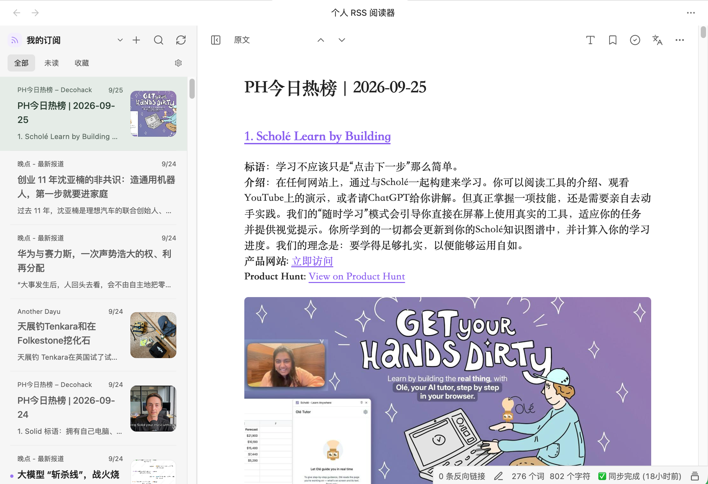

# Personal RSS Reader · 个人 RSS 阅读器

一个以个人 RSS / Atom 订阅为核心的 Obsidian 本地阅读器。项目基于 `qiaomu-ai-rss` 修改，保留原作者版权与 GPL-3.0-only 许可。

本项目与原项目的定位不同：[`qiaomu-ai-rss`](https://github.com/joeseesun/qiaomu-ai-rss) 提供更完整的聚合频道、远程服务、内容处理与笔记集成体验；本项目则专注于个人 RSS / Atom 订阅、本地数据和用户自备模型，尽量减少对项目服务端的依赖。原项目非常优秀，并且仍在持续迭代，建议优先使用原项目；如果你更需要一个边界清晰、以本地个人订阅为主的阅读器，再选择本项目。

## 功能



### 主要功能

- 手动添加、编辑、分组和取消 RSS / Atom 订阅，支持 OPML 导入预览、去重与导出。
- 通过“我的订阅”、订阅分组和单个订阅源组织内容。
- 支持搜索、未读筛选、收藏、专注阅读和可调排版。
- 安全清理 RSS 正文，支持文章图片、缩略图及本地图片缓存。
- 阅读记录、订阅、收藏、译文和设置均保存在当前 Obsidian vault 的插件数据中。

### 改造部分

- 移除乔木聚合频道、乔木远程 API，以及依赖远程服务的翻译和改写功能。
- 保留“探索”入口，改为内置的离线推荐与中文独立博客目录；浏览目录时不会批量请求网站。
- 增加可选的网页全文获取：Feed 正文不足时，在打开文章后尝试提取原网页正文。
- 增加用户自备 OpenAI-compatible 模型的手动段落翻译，可切换原文、双语和仅译文。
- 移除日记/笔记写入、摘录浮层、内部回跳、图片拖入笔记和库内 Markdown 来源，使插件专注于个人订阅阅读。

## 安装

需要 Obsidian 1.13.0 或更新版本，可选择以下任一方式安装。

### 方式一：直接复制（推荐）

下载项目中的 `main.js`、`manifest.json` 和 `styles.css`，复制到：

```text
.obsidian/plugins/personal-rss-reader/
```

这是最简单的安装方式，不需要 Node.js 或其他构建工具。

### 方式二：Fork 后自行构建

Fork 本项目并克隆你自己的仓库，然后安装依赖并构建：

```sh
git clone https://github.com/<你的账号>/Personal-Rss-Reader.git
cd Personal-Rss-Reader
npm ci
npm run build
```

构建完成后，将生成的 `main.js` 与仓库中的 `manifest.json`、`styles.css` 一起复制到上述插件目录。

最后在 Obsidian 的“设置 → 第三方插件”中启用 **Personal RSS Reader**。

## 使用

点击侧边栏 RSS 图标或运行“打开个人 RSS 阅读器”。点击列表顶部的 `+` 可以：

1. 粘贴 RSS / Atom 地址并添加可选分组；
2. 导入或导出 OPML；
3. 在“探索”中搜索并订阅推荐来源。

频道选择器只展示“我的订阅”、分组和个人订阅源。选择频道时会刷新超过 5 分钟的缓存；刷新按钮会强制请求。刷新最多并发请求 3 个源，20 秒超时，失败时保留旧文章。

首次添加订阅时只保存该源最新的 5 篇文章；后续刷新每源最多保存 50 篇。

“设置 → 阅读 → 自动获取网页全文”默认关闭。开启后，只有打开正文不足 200 字的文章才会额外请求其网页；提取到明显更完整的正文后缓存，后续阅读复用缓存。每次打开最多尝试一次，15 秒超时，超过 2 MB 的响应不解析；失败时显示 Feed 原内容或打开原文的提示。此功能不能保证获取动态加载、登录或付费内容，也不会绕过网站访问限制。Obsidian 的网络接口会自动处理重定向，插件无法在发起请求前逐跳核验目标；仅适合订阅你信任的来源。

## AI 翻译

在设置的“AI 翻译”页填写启用开关、API Base URL、API Key、模型和目标语言。未启用或配置不完整时不会发送任何模型请求。

翻译只会在点击文章工具栏的“生成翻译”后进行：

- 使用 OpenAI-compatible `POST /chat/completions`；
- 每批最多 4 个正文块、约 1,200 字符，同时最多 2 批；
- 当前视口附近最多 6 个块优先；
- 响应必须是严格等长 JSON 字符串数组，否则整批拒绝；
- 已完成批次立即保存，失败段落可重试；
- 译文以纯文本节点显示，模型输出不会作为 HTML 执行；
- 有效文章缓存和全局翻译记忆会复用，正文或模型配置变化后自动失效。

API Key 以明文保存在插件 `data.json`，不会写入日志、缓存键或 OPML。如果同步 `.obsidian`，它可能随所用同步工具上传。默认只允许 HTTPS；`localhost` 和 `127.0.0.1` 可明确使用 HTTP，但移动设备不能直接访问桌面电脑的本机地址。

## 隐私与网络

- 正常启动、浏览探索目录和阅读本地缓存不会请求项目自建服务。
- 刷新订阅时只请求用户添加的 RSS / Atom 地址。
- 开启“自动获取网页全文”后，打开正文较短的文章可能额外请求文章网页；目标网站会收到普通网络连接信息。
- 启用图片时会请求文章图片地址并保存到本地插件缓存。
- 只有点击“测试连接”或“生成翻译”时，才请求用户配置的模型服务。
- 模型请求只包含目标语言、最小翻译指令和本批正文纯文本，不包含文章链接、订阅列表、收藏或已读状态。
- 本项目不提供账号、服务器、代理、额度或遥测，也不收集密钥、正文、译文和阅读行为。

## 开发

```sh
npm ci
npm run check
```

构建产物为 `main.js`。许可证、字体许可和中文独立博客目录授权见 [LICENSE](LICENSE)、[fonts/OFL.txt](fonts/OFL.txt) 与 [THIRD_PARTY_NOTICES.md](THIRD_PARTY_NOTICES.md)。
